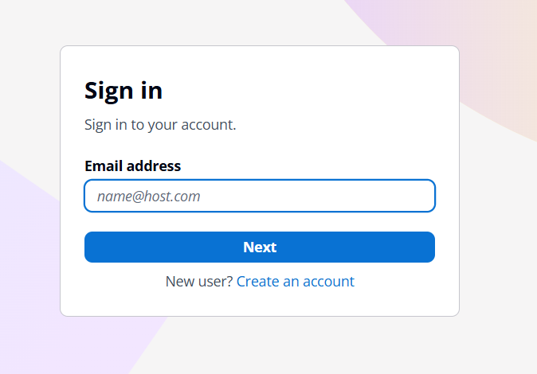
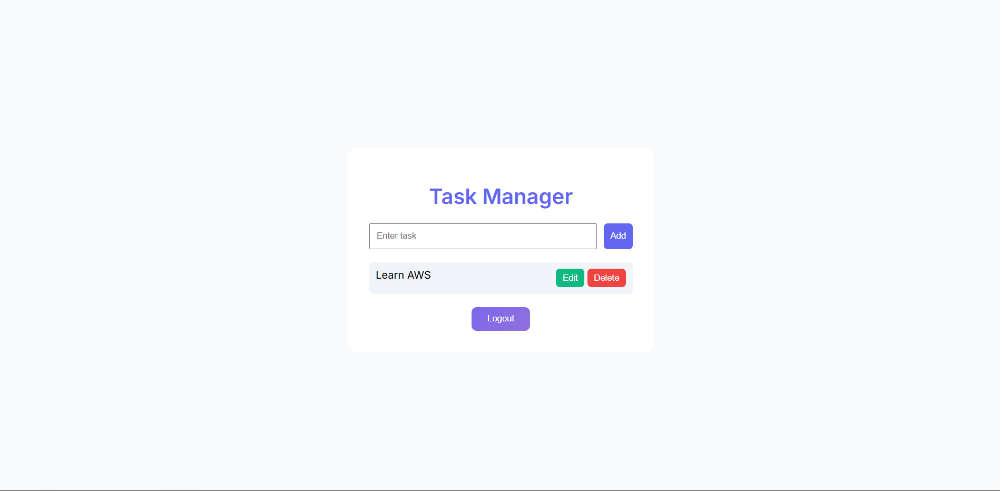

# 🚀 Serverless Task Manager (AWS)

## 📌 Project Overview

This project is a cloud-native Task Manager application that allows users to:

- Add tasks
- View tasks
- Edit tasks
- Delete tasks

Each user can only access their own tasks using secure authentication.

---

## 🧱 Architecture

Frontend:

- HTML, CSS, JavaScript
- Hosted on Amazon S3
- Delivered via CloudFront

Backend:

- AWS Lambda (Python)
- Amazon API Gateway (REST API)

Database:

- Amazon DynamoDB

Authentication:

- Amazon Cognito (User Login & Security)

CI/CD:

- GitHub Actions (Auto deployment to Lambda)

---

## 🔐 Features

- ✅ User authentication using Cognito
- ✅ Multi-user support (each user sees only their tasks)
- ✅ CRUD operations (Create, Read, Update, Delete)
- ✅ Secure API with JWT token
- ✅ Serverless architecture
- ✅ CI/CD pipeline for automatic deployment

---

## 🔐 Security

- Cognito JWT tokens used for API authorization
- User-specific data isolation using DynamoDB partition key
- Protected endpoints via API Gateway authorizer

---

## 📁 Project Structure

```
Task_Manager/
│
├── backend/
│   └── lambda_function.py
│
│
├── frontend/
│   └── index.html
│
├── images/
│   ├── login.png
│   ├── dashboard.png
│   └── task_manager.png
│
├── .github/
│   └── workflows/
│       └── deploy.yml
│
├── README.md
└── .gitignore
```

## ⚙️ Technologies Used

- AWS Lambda
- Amazon API Gateway
- Amazon DynamoDB
- Amazon Cognito
- Amazon S3
- Amazon CloudFront
- Python (boto3)
- JavaScript (Fetch API)
- GitHub Actions (CI/CD)

---

## 🔄 CI/CD Pipeline

- Code is pushed to GitHub
- GitHub Actions triggers automatically
- Lambda function is updated without manual deployment

---

## 🌐 Live Demo

👉 [Live App](https://d1o5wmhaozdnjc.cloudfront.net)

---

## 🧪 How to Run

1. Open the frontend URL (CloudFront)
2. Login via Cognito
3. Start managing tasks

---

## 📸 Screenshots




---

## 🎯 Learning Outcomes

- Built a complete serverless application
- Implemented secure authentication using Cognito
- Designed REST APIs using API Gateway + Lambda
- Used DynamoDB with indexing for multi-user support
- Implemented CI/CD using GitHub Actions

---

## 👨‍💻 Author

**Dhaksin Kaarthick**

---

## ⭐ Future Improvements

- Add task deadlines
- Add task status (completed/pending)
- Improve UI/UX
- Add notifications

---
